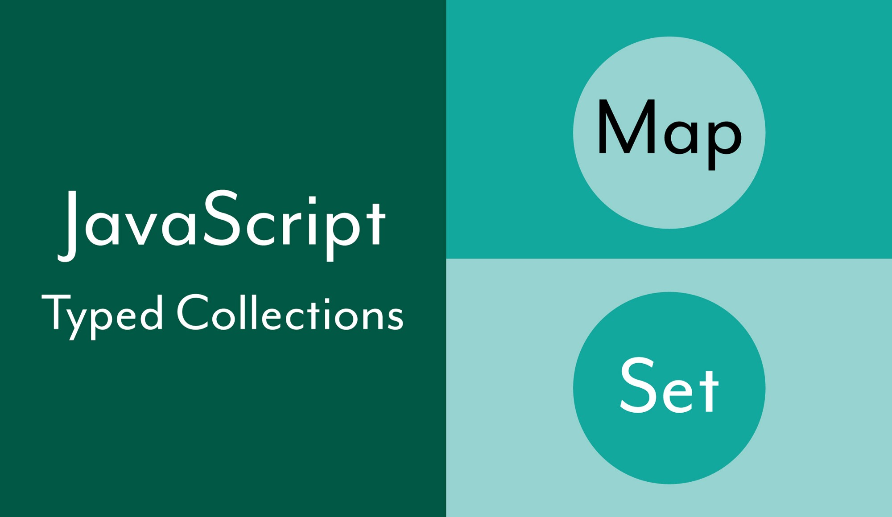

# JavaScript — Getting Started with the Map and Set Typed Collections



JavaScript has many different ways to group and collect data including in arrays and objects. There are also two other main ways to organize collections of data — Maps and Sets. Although arrays and objects provide many useful features, they also come with some disadvantages. For example, an object is a key collection of values but does not allow for easy iteration of the values or finding the size of the collection. The Map and Set collections can be useful and provide advantages in certain situations over an array or object.

## Map

The [Map](https://developer.mozilla.org/en-US/docs/Web/JavaScript/Reference/Global_Objects/Map) object provides a way to hold collections of key-value pairs. The Map maintains the order in which data is added into the Map object, which will be retrieved in order when the **Map** is iterated.

### Features of the Map object

Maps can be created by invoking the **Map()** constructor. The constructor can be invoked without parameters or an optional iterable value.

```js
let employees = new Map();
let managers = new Map([
  ["quang", 20],
  ["kal", 36],
]);
```

The Map object has one property and several useful methods to work with the Map.

- **size** is a property that returns the total number of key-value pairs held by the Map object.
- **set(key, value)** is a method to append a new key-value pair to a Map.
- **get(key)** is a method to retrieve a value from a Map by its key.
- **has(key)** is a method to return a boolean based on whether or not a key value is included within a Map object.
- **delete(key)** is a method that will remove the key-value pair from a Map object based on a key and will return a boolean depending on whether or not the key-value pair is deleted or not.
- **clear()** removes all key-value pairs from the Map.

### Working with the Map object

A key benefit of using Maps is the flexibility they offer, as can be shown with some examples.

```js
let employee = new Map();
employee.set("name", "Quang");
employee.set("age", 20);
employee.set("title", "manager");
employee.set("skills", ["javascript", "python", "java"]);
employee.size; // 4
employee.get("name"); // 'Quang'
employee.has("title"); // true
employee.set("name", "melvin");
employee.get("name"); // 'melvin'
employee.delete("age"); // true
employee.size; // 3
employee.clear();
employee.size; // 0
```

A key feature of the **Map** object is the ability to use any data type as the keys. This is different from an **Object**, which only allows strings or symbols to be used for keys.

```js
let person = new Map();
person.set("name", "Quanng");
person.set(10, "rating level");
let age = Symbol("age of person");
person.set(age, 36);
let education = ["high school", "college", "coding bootcamp"];
person.set(education, "completed");
let contacts = {
  supervisor: "jim",
  friend: "hal",
};
person.set(contacts, "work and home");
```

### Methods to iterate over a Map object

The **Map** object also has several different ways to iterate. It can iterator over its keys and/or values through the Map object methods or by using the **for..of** or **forEach** loops.

- **keys()** returns an iterator object that contains the keys for each item.
- **values()** returns an iterator object that contains the values for each item.
- **entries()** returns an iterator object that contains the array of [key, value] for each element of the **Map** object.

```js
let employee = new Map();
employee.set("name", "Quang");
employee.set("age", 20);
employee.set("title", "manager");
employee.set("certified", true);
employee.keys(); // [Map Iterator] { 'name', 'age', 'title', 'certified' }
employee.values(); // [Map Iterator] { 'Quang', 20, 'manager', true }
employee.entries(); // [Map Entries] { [ 'name', 'Quang' ], [ 'age', 20 ], [ 'title', 'manager' ], [ 'certified', true ] }
for (const [key, value] of employee) {
  console.log(`employee ${key} is ${value}`);
}
// employee name is Quang
// employee age is 20
// employee title is manager
// employee certified is true
```

Map objects can also iterated with the **forEach()** method.

```js
employee.forEach((key, value) => {
  console.log(`employee ${key} is ${value}`);
});
```

## Set

The [Set](https://developer.mozilla.org/en-US/docs/Web/JavaScript/Reference/Global_Objects/Set) object is collection of values that can be of any type of primitive value. **_Each value in a Set is unique_**, which means it can only appear once within the **Set** object.

```js
let employees = new Set();
let managers = new Set(["Quang", "kal", "melvin"]);
```

The Set object has one property and several useful methods to work with the Map.

- **size** is a property that returns the total number of values held by the Set object.

- **add(value)** is a method to append a new value to a Set.

- **has(value)** is a method to return a boolean based on whether or not a value is included within a Set object.

- **delete(value)** is a method that will remove the value from a Set object and will return a boolean depending on whether or not the value is deleted or not.

- **clear()** removes all values from the Set.

### Working with the Set object

A key benefit of using Sets is that they maintain the order of which the values are added to the Set. They also are iterable.

```js
let employees = new Set();
employees.add("melvin");
employees.add("Quang");
employees.add("lou");
employees.add("gill");
employees.size; // 4
employees.has("jim"); // false
employees.has("lou"); // true
employees.delete("Quang"); // true
employees.size; // 3
employees.clear();
employees.size; // 0
```

### Methods to iterate over a Set object

The **Set** object also has several different ways to iterate over the Set object, which unlike a Map, only has values. It can be iterated either through the Set object methods or by using the **forEach** loop.

- **values()** returns an iterator object that contains the values for each item.

- **keys()** functions identically to the values() method for a Set object.

- **entries()** returns an iterator object that contains the array of [value, value] for each element of the Set object.

```js
let holidays = new Set();
holidays.add("Mothers Day");
holidays.add("Flag Day");
holidays.add("Memorial Day");
holidays.add("Halloween");
holidays.values(); // [Set Iterator] { 'Mothers Day', 'Flag Day', 'Memorial Day', 'Halloween' }
holidays.keys(); // [Set Iterator] { 'Mothers Day', 'Flag Day', 'Memorial Day', 'Halloween' }
holidays.entries(); // [Set Entries] { [ 'Mothers Day', 'Mothers Day' ], [ 'Flag Day', 'Flag Day' ], [ 'Memorial Day', 'Memorial Day' ], [ 'Halloween', 'Halloween' ] }
```

Set objects can also iterated with the **forEach()** method.

```js
holidays.forEach((value) => {
  console.log(`holiday ${value}`);
});
```

## Conclusion

The **Map** and **Set** objects provide similar, but useful alternatives to arrays and objects for storing collections of data. Maps and Sets offer some clear advantages over arrays and objects - most notably that they maintain the order of the entries as they are added to a collection, which is unlike a collection. And unlike arrays, Maps allow collections with key-value pairs of any type of data, offering a lot of flexibility. They also offer some performance benefits when searching through collection entries.
